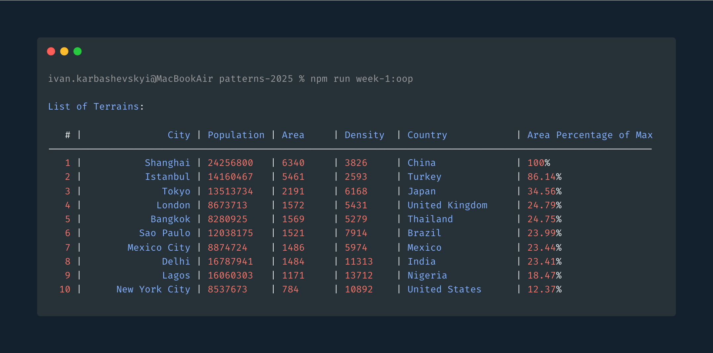

# Object-Oriented Programming (OOP) Solution


## Overview
This solution demonstrates the principles of Object-Oriented Programming (OOP) by implementing a utility to parse CSV data into structured objects. The solution includes unit tests to validate the functionality.

## Features
- **Encapsulation**: The `FromCSV` class encapsulates the logic for parsing CSV data.
- **Abstraction**: The `IFromCSVParams` interface abstracts the configuration for the `FromCSV` utility.
- **Polymorphism**: The `factory` method allows for flexible object creation based on the parsed data.
- **Inheritance**: The solution can be extended to support additional CSV parsing features.

## Hot to Run the project
```bash
npm run week-1:oop
```

## How to Run the tests
```bash
npm run test:week-1:oop
```

## Components

### 1. `FromCSV` Class
The `FromCSV` class is responsible for:
- Parsing CSV data.
- Validating the data using custom validation rules.
- Converting the data into structured objects using a factory function.

#### Methods
- `parse()`: Parses the CSV data and returns an array of objects.
- `valid()`: Checks if the CSV data is valid.
- `invalid()`: Checks if the CSV data is invalid.
- `getErrors()`: Returns a list of validation errors.
- `create()`: Static method to create an instance of `FromCSV`.

### 2. `IFromCSVParams` Interface
Defines the configuration for the `FromCSV` utility, including:
- `source`: The CSV data as a string.
- `delimiter`: The delimiter used in the CSV data.
- `factory`: A function to create objects from the parsed data.

### 3. Unit Tests
The `oop.test.ts` file contains unit tests to validate the functionality of the `FromCSV` utility. The tests include:
- Single element CSV.
- Multiple elements CSV.
- Empty CSV.
- Data from fixtures.


## Example Usage
```typescript
import { FromCSV } from "./unitl/from-csv";
import { Terrain } from "./domain/model/terrain";
import { TerrainMapper } from "./application/mapper/terrain.mapper";

const csvData = "city,population,area,density,country\nShanghai,24256800,6340,3826,China";
const mapper = TerrainMapper.create();

const fromCSV = FromCSV.create<Terrain>({
    source: csvData,
    factory: (object) => mapper.fromObject(object),
});

if (fromCSV.valid()) {
    const items = fromCSV.parse();
    console.log(items);
} else {
    console.error(fromCSV.getErrors());
}
```

## Directory Structure
```
week-1/solution/oop/
├── application/
│   └── mapper/
│       └── terrain.mapper.ts
├── domain/
│   └── model/
│       └── terrain.ts
├── interface/
│   └── i.from-csv-params.ts
├── unitl/
│   └── from-csv.ts
├── oop.test.ts
└── README.md
```

## Notes
- Ensure that the `data` in the `fixture.ts` file is correctly formatted for testing.
- The `FromCSV` utility is designed to be extensible and reusable for various CSV parsing needs.