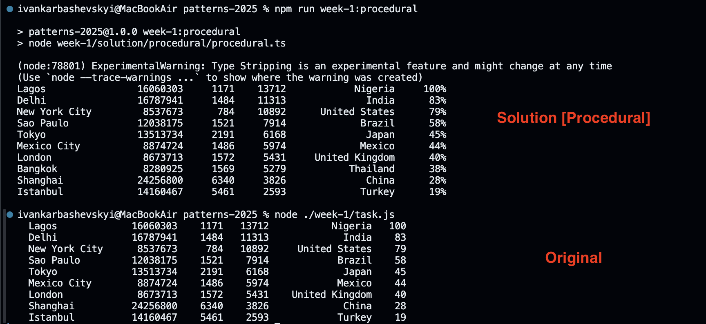

# Procedural Programming Solution


## Overview
This solution demonstrates the procedural programming paradigm by implementing CSV parsing and data processing using simple functions and data structures. The code is organized as a sequence of steps, focusing on clarity and directness without object-oriented abstractions.

## Features
- Step-by-step logic using plain functions
- Functions for parsing, validation, and data transformation
- Easy to follow and modify for small to medium-sized tasks
- No classes or inheritance, just data and functions

## How to Run the Project
```bash
npm run week-1:procedural
```

## Example Usage
```typescript
const csv = `city,population,area,density,country\nShanghai,24256800,6340,3826,China`;
const fieldConverter = {
    string: (x) => String(x),
    number: (x) => Number(x),
};
const city = [ // Order of the properties is important
    { name: 'city', type: 'string', },
    { name: 'population', type: 'number', },
    { name: 'area', type: 'number', },
    { name: 'density', type: 'number', },
    { name: 'country', type: 'string', },
    { name: 'densityPercentageOfMax', type: 'number', },
];
const cities = CSVToObject({
    csv,
    schema: city,
    fieldConverter,
});
console.log(cities);
```

## Directory Structure
```
week-1/solution/procedural/
├── procedural.ts
├── procedural.test.ts
└── README.md
```